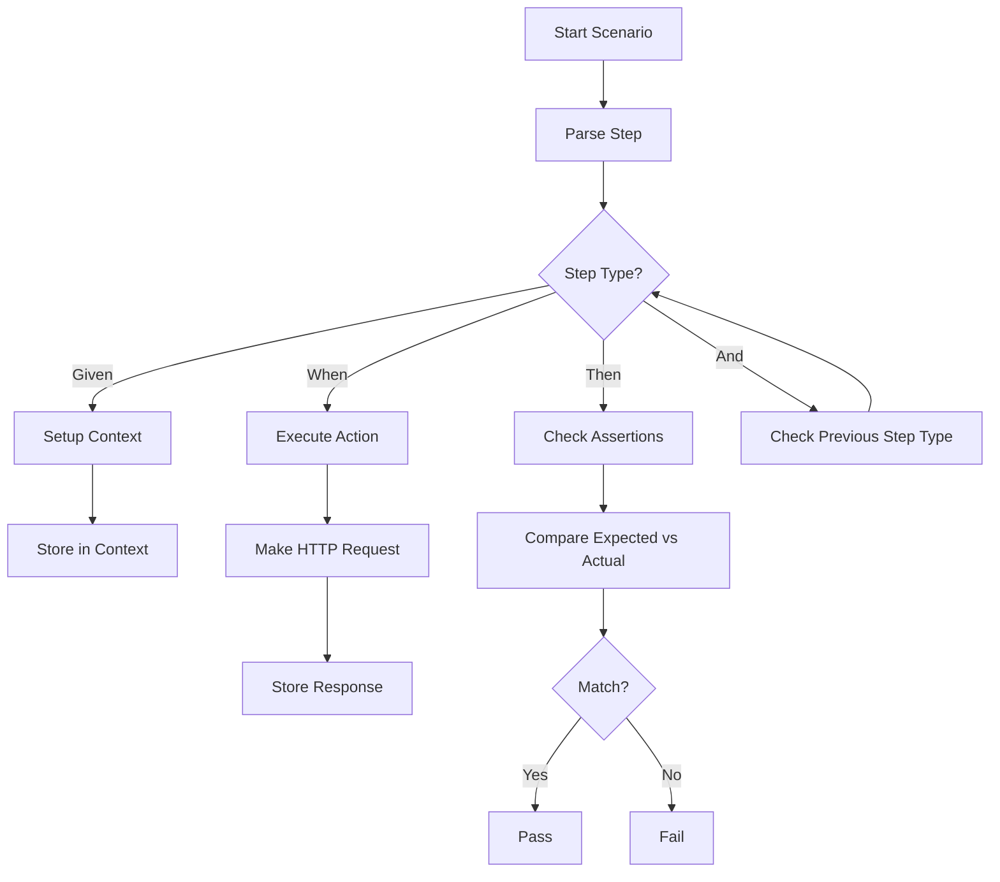
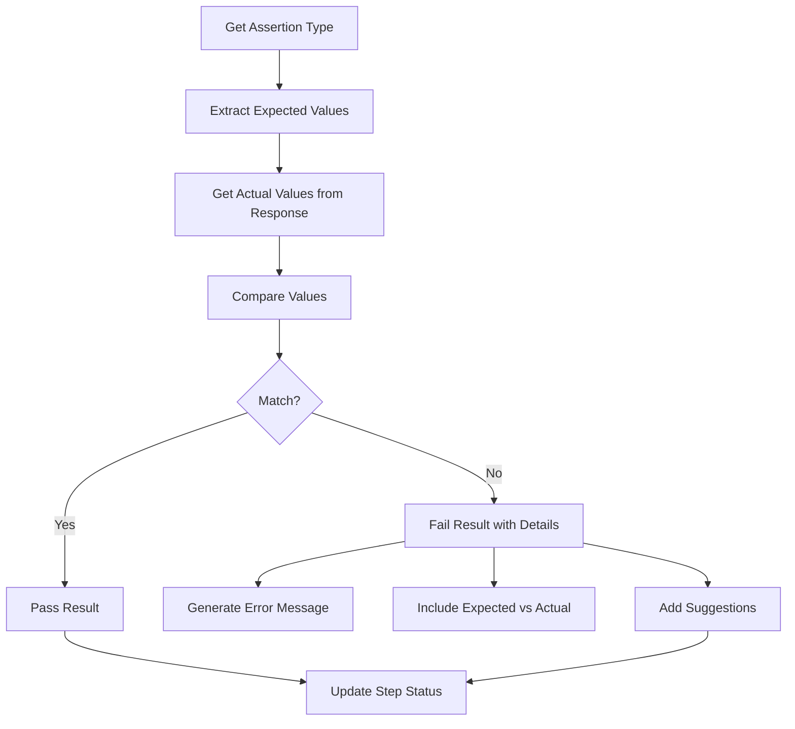
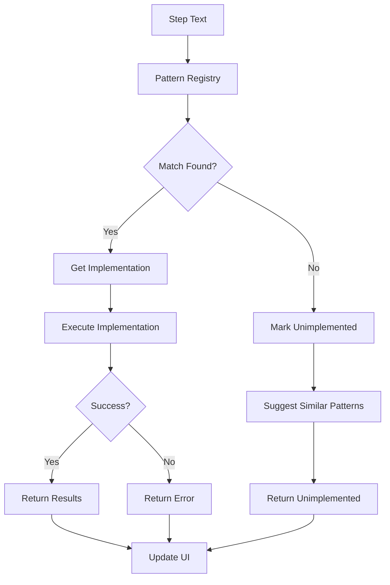
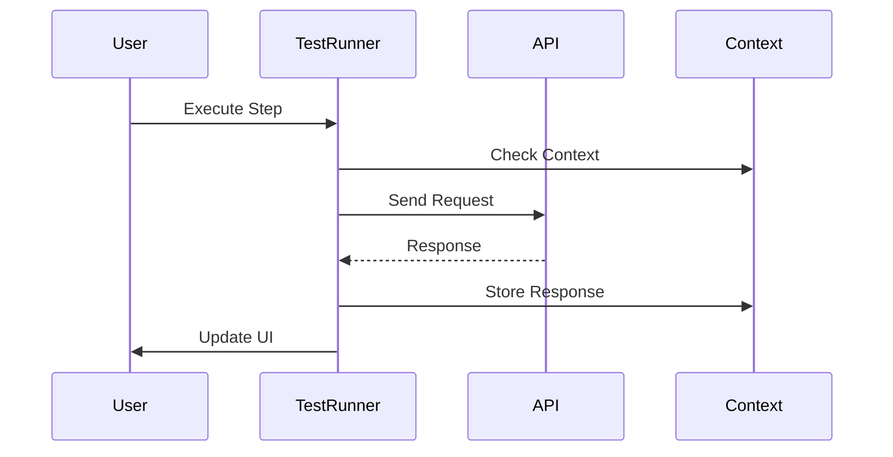
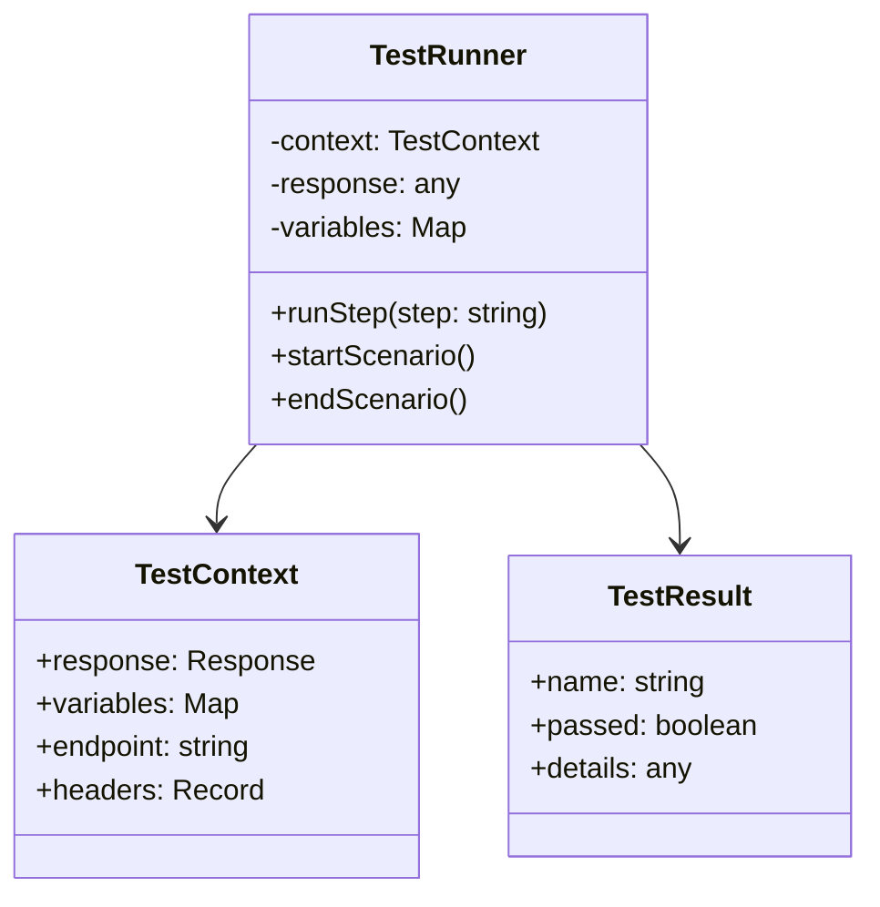

# RestUI - API Testing Interface

RestUI is a modern, feature-rich API testing interface that allows you to create, manage, and execute API tests using a behavior-driven development (BDD) approach.

## Test Step Execution Flow

The test execution follows a structured flow based on the Given-When-Then pattern:



### Step Types and Their Roles

1. **Given Steps (Setup)**
   - Set endpoint: `Given endpoint "http://api.example.com"`
   - Set headers: `Given header "Content-Type" with value "application/json"`
   - Set variables: `Given variable "userId" with value "123"`

2. **When Steps (Actions)**
   - Send HTTP requests: `When send a GET request`
   - Wait for time: `When wait for 5 seconds`
   - Store responses in context

3. **Then Steps (Assertions)**
   ```typescript
   // Assertion Types:
   1. Response Validity
   - "response should be valid with status 200"
   - "response should be valid"
   
   2. Status Checks
   - "status should be 200"
   
   3. Path Value Checks
   - 'path "data.id" should be 123'
   
   4. Array Length Checks
   - "should have 5 items"
   
   5. Header Checks
   - 'header "Content-Type" should be "application/json"'
   
   6. Variable Checks
   - 'variable "userId" should be "123"'
   ```

### Assertion Resolution Flow



### Step Implementation Pattern Flow



### System Components and Interactions



### Core Classes



## Key Features

1. **Pattern Management**
   - Add, edit, and remove step patterns
   - Custom implementation support
   - Built-in pattern protection
   - Pattern suggestions for unimplemented steps

2. **Context Management**
   ```typescript
   interface TestContext {
       response: {
           status: number;
           body: any;
           headers: Record<string, string>;
       };
       variables: Map<string, any>;
       endpoint: string;
       headers: Record<string, string>;
   }
   ```

3. **Result Structure**
   ```typescript
   interface TestResult {
       name: string;
       passed: boolean;
       details: {
           expected: any;
           actual: any;
           suggestion?: string;
       }
   }
   ```

4. **Error Handling**
   - Invalid JSON responses
   - Missing response data
   - Network errors
   - Unimplemented steps
   - Invalid assertions

## Custom Step Implementation

Users can add new step patterns in the settings page:

1. Navigate to Settings
2. Click "Add Pattern"
3. Define:
   - Pattern Type (Given/When/Then)
   - Pattern RegExp
   - Description
   - Implementation Code

Example custom implementation:
```typescript
const match = step.match(/custom pattern "([^"]+)"/);
if (match) {
    const [_, value] = match;
    return [{
        name: 'Custom Check',
        passed: true,
        details: { value }
    }];
}
```

## Status Indicators

- ✓ Passed (Green)
- ✗ Failed (Red)
- ? Unimplemented (Orange)
- ⟳ Running (Blue)

## Contributing

1. Fork the repository
2. Create your feature branch
3. Add tests for new features
4. Submit a pull request

## License

This project is licensed under the MIT License - see the LICENSE file for details. 